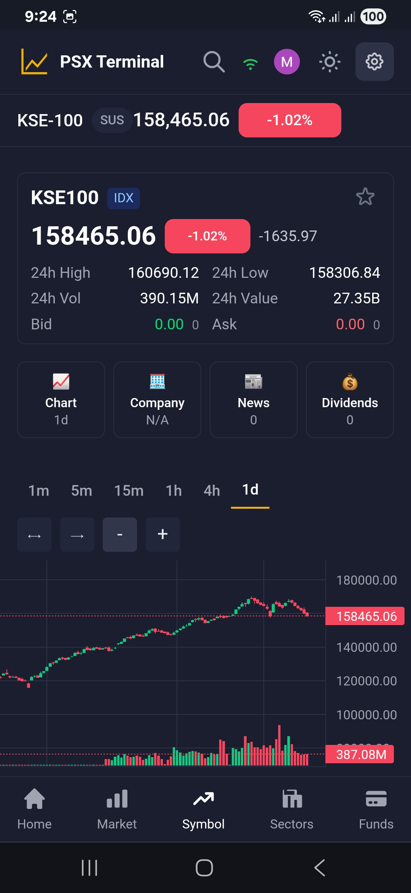
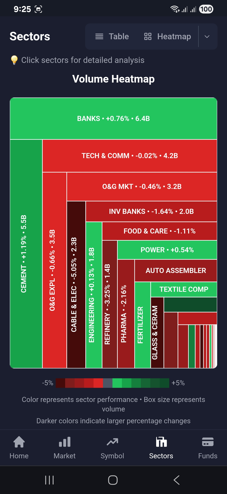
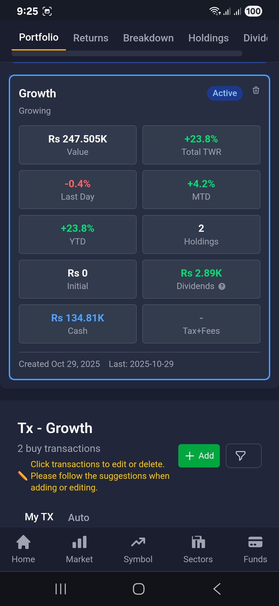
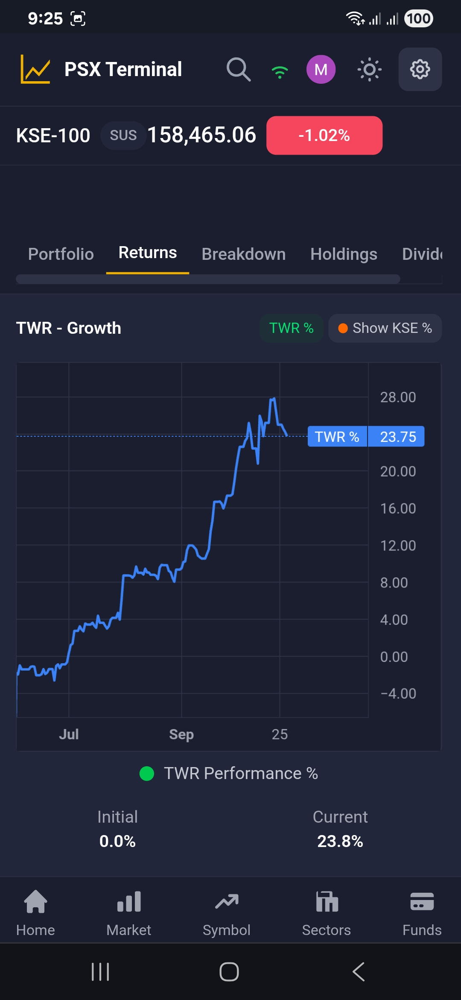
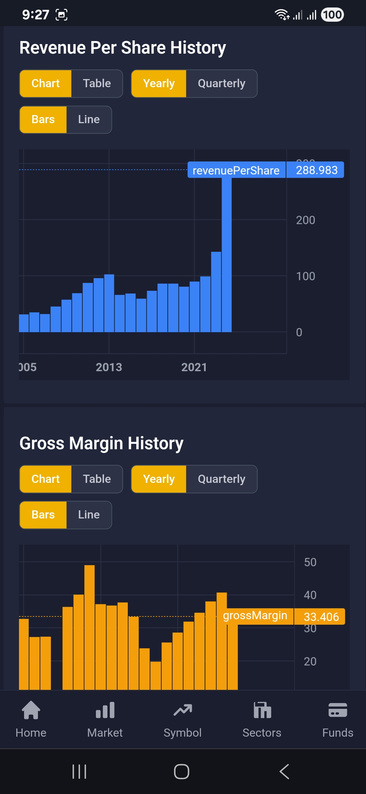
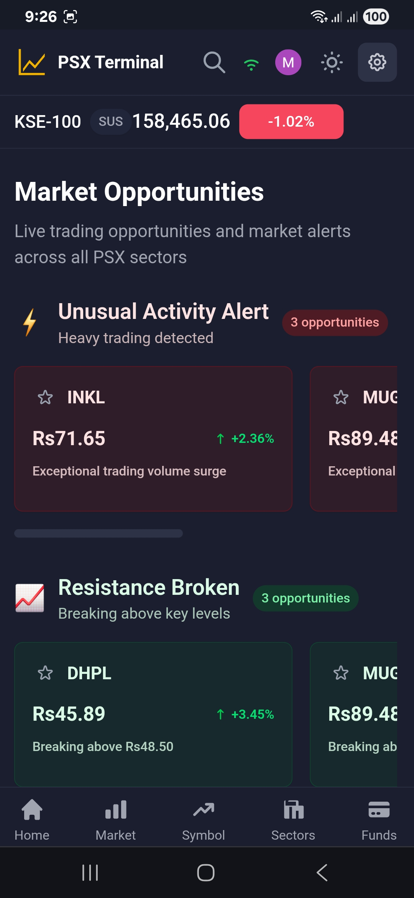
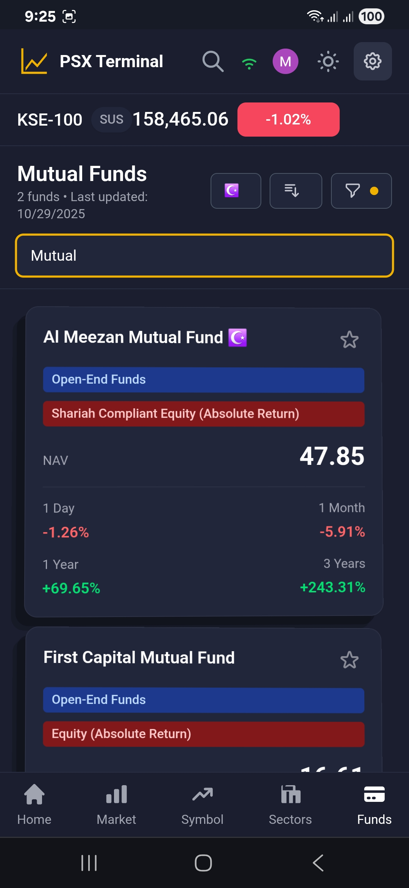
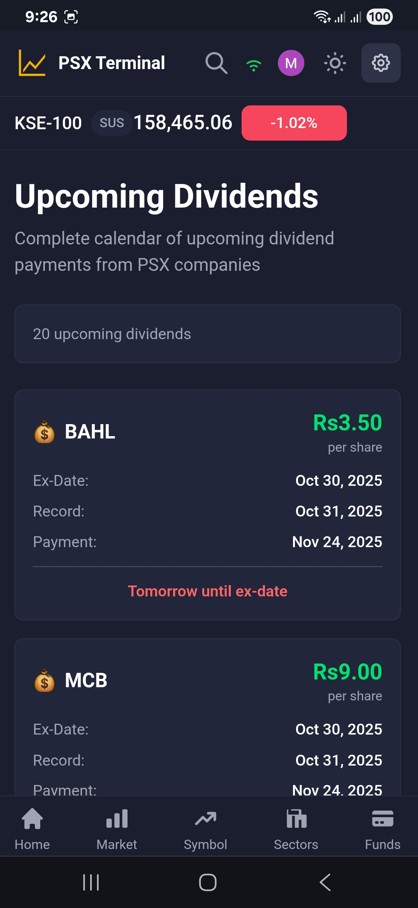

# PSX Terminal

<div align="center">


[](https://github.com/mumtazkahn/psx-terminal)
[](LICENSE)
[](API.md)
[](https://psxterminal.com)

**Professional Real-time Market Data Platform with Market Intelligence and Advanced Portfolio Tracking for Pakistan Stock Exchange**

*Modern web-based terminal for live market monitoring, data visualization, comprehensive market analysis, and intelligent portfolio management*

[🌐 Live Platform](https://psxterminal.com) • [📚 API Docs](API.md) • [🏗️ Architecture](ARCHITECTURE.md) • [💻 Examples](examples/) • [📸 Screenshots](screenshots/)

</div>

---

## 📊 Performance Metrics

<div align="center">

| Metric | Value | Description |
|--------|-------|-------------|
| **Latency** | Real-time | Live data delivery |
| **Uptime** | High | Production reliability |
| **Symbols** | Comprehensive | Market coverage |
| **Updates/sec** | 1,000/sec | Real-time throughput |
| **Portfolio Data** | 5 Years | State-of-the-art tracking |

</div>

---

## ⚡ Quick Start

### Try the Platform
1. **Visit** [psxterminal.com](https://psxterminal.com)
2. **Explore** real-time market data
3. **Test** WebSocket API
4. **Check** documentation

### Integrate Our API
```bash
# Get live market data for a symbol
curl "https://psxterminal.com/api/ticks/REG/HUBC"

# Get market statistics
curl "https://psxterminal.com/api/stats/REG"

# Get dividend history
curl "https://psxterminal.com/api/dividends/MARI"
```

### For Developers
- 📖 [API Documentation](API.md)
- 💻 [Integration Examples](examples/)
- 🏗️ [Architecture](ARCHITECTURE.md)

---

## ✨ Features

### 📈 Real-time Market Data
- **Live price updates** across all PSX markets (REGULAR, FUTURES, Indices, ODD Lot, BILLS and BONDS)
- **Real-time charts** with multiple timeframes (1m, 5m, 15m, 1h, 4h, 1d)
- **Market breadth indicators** showing advances vs declines
- **Instant tick-by-tick** price streaming

### 💼 Advanced Portfolio Tracking
- **5 years of historical data** with state-of-the-art portfolio analytics
- **Deep insights and performance** tracking across extended periods
- **Comprehensive transaction support** including splits, bonus, rights, and CGTs that nobody else provides
- **Professional portfolio management** tools with detailed analytics

### 🔍 Market Intelligence & Analysis Tools
- **ToWatch Opportunity Scanner** algorithmically spots live market opportunities across multiple categories
- **Top gainers and losers** monitoring with intelligent screening
- **Volume and value** analysis with advanced metrics
- **Sector performance** breakdown with deep insights
- **Market statistics** and breadth indicators
- **Symbol lookup** with detailed comprehensive data

### 📅 Dividend & Calendar Intelligence
- **Complete dividend calendar** for informed investment decisions
- **Upcoming dividend announcements** with timeline tracking
- **Historical dividend analysis** with performance metrics

### 🏦 Comprehensive Mutual Funds Coverage
- **Complete mutual funds database** with sectors and professional ratings
- **All-time historical data** of every fund with detailed performance tracking
- **Portfolio distribution analysis** showing fund holdings and allocations
- **Fund performance comparisons** with benchmark analysis

### 📰 Real-time Market News
- **Live market news** with automatic data extraction
- **No manual PDF reading required** - intelligent content processing
- **Market-moving announcements** with real-time updates
- **Company-specific news** filtering and organization

### 📊 Deep Research Portal
- **Comprehensive stock fundamentals** research platform
- **Financial statements analysis** across 10 years of data
- **Payout and valuation metrics** with historical trends
- **Income and balance sheets** with both visualization and detailed tables
- **Multi-year comparative analysis** for informed decision making

### 📊 Professional Interface
- **Interactive candlestick charts** with multiple timeframes
- **Customizable watchlists** and monitoring dashboards
- **Advanced filtering** and search capabilities
- **Dark/Light theme** with responsive design
- **Progressive Web App** for seamless mobile experience

### 🛠️ Developer APIs
- **RESTful APIs** for market data access
- **WebSocket streaming** for real-time updates
- **Comprehensive documentation** with examples
- **Rate limiting** and usage guidelines

---

## 📸 Platform Preview

<div align="center">

<div style="display: flex; overflow-x: auto; gap: 15px; padding: 20px; scroll-behavior: smooth;">
  <div style="flex: none; width: 300px;">
    
    <p style="text-align: center; margin-top: 8px; font-weight: bold;">Home</p>
  </div>
  
  <div style="flex: none; width: 300px;">
    
    <p style="text-align: center; margin-top: 8px; font-weight: bold;">Market</p>
  </div>
  
  <div style="flex: none; width: 300px;">
    
    <p style="text-align: center; margin-top: 8px; font-weight: bold;">Symbol</p>
  </div>
  
  <div style="flex: none; width: 300px;">
    
    <p style="text-align: center; margin-top: 8px; font-weight: bold;">Sectors</p>
  </div>
  
  <div style="flex: none; width: 300px;">
    
    <p style="text-align: center; margin-top: 8px; font-weight: bold;">Portfolio</p>
  </div>
  
  <div style="flex: none; width: 300px;">
    
    <p style="text-align: center; margin-top: 8px; font-weight: bold;">Distribution</p>
  </div>
  
  <div style="flex: none; width: 300px;">
    
    <p style="text-align: center; margin-top: 8px; font-weight: bold;">Research</p>
  </div>
  
  <div style="flex: none; width: 300px;">
    
    <p style="text-align: center; margin-top: 8px; font-weight: bold;">News</p>
  </div>
  
  <div style="flex: none; width: 300px;">
    
    <p style="text-align: center; margin-top: 8px; font-weight: bold;">ToWatch</p>
  </div>
  
  <div style="flex: none; width: 300px;">
    
    <p style="text-align: center; margin-top: 8px; font-weight: bold;">Funds</p>
  </div>
  
  <div style="flex: none; width: 300px;">
    
    <p style="text-align: center; margin-top: 8px; font-weight: bold;">Dividends</p>
  </div>
</div>

*👆 Swipe left/right to explore all platform features*

*[View all screenshots →](screenshots/)*

</div>

---

## 🚀 Technology Stack

### Frontend
- **SvelteKit** - Server-side rendering with optimal performance
- **TailwindCSS** - Utility-first responsive design system
- **Lightweight Charts** - Financial charting optimized for real-time data
- **Progressive Web App** - Native app-like experience

### Backend
- **Node.js** - Event-driven runtime for high concurrency
- **Express.js** - Minimalist web framework
- **WebSocket** - Real-time data streaming
- **PostgreSQL** - ACID-compliant data persistence
- **Redis** - High-performance caching and session management

---

## 📱 Platform Access

### Web Application
Visit **[psxterminal.com](https://psxterminal.com)** for full market monitoring:
- Real-time dashboard with live updates
- Interactive charts with multiple timeframes
- Advanced portfolio tracking with 5 years of data
- Customizable watchlists and tools
- Sector performance tracking
- Comprehensive mutual funds coverage
- Real-time news with automatic data extraction
- Deep research portal with 10 years of financial data
- ToWatch opportunity scanner
- Complete dividend calendar
- Mobile-optimized responsive interface
- Progressive Web App functionality

### API Access
Integrate PSX data into your applications:
- **REST API** for market data queries
- **WebSocket API** for live streaming
- **Comprehensive documentation** with examples

---

## 📊 Market Coverage

| Market | Description | Coverage | Real-time |
|--------|-------------|----------|-----------|
| **REGULAR** | Regular Market | Listed companies | ✅ |
| **FUTURES** | Futures | Commodity/index futures | ✅ |
| **Indices** | Indices | KSE-100, KSE-30, sectors | ✅ |
| **ODD Lot** | Odd Lot | Fractional shares | ✅ |
| **BILLS and BONDS** | Bills and Bonds | Government/corporate | ✅ |

---

## 🔌 API Examples

### REST API
```bash
# Get single symbol market data
curl "https://psxterminal.com/api/ticks/REG/HUBC"

# Get all available symbols
curl "https://psxterminal.com/api/symbols"

# Get market statistics
curl "https://psxterminal.com/api/stats/REG"

# Get company information
curl "https://psxterminal.com/api/companies/HUBC"

# Get fundamental analysis
curl "https://psxterminal.com/api/fundamentals/HUBC"

# Get dividend history
curl "https://psxterminal.com/api/dividends/MARI"

# Get historical kline data
curl "https://psxterminal.com/api/klines/HUBC/1h?limit=50"
```

### WebSocket
```javascript
import WebSocket from 'ws';

// Connect and subscribe
const ws = new WebSocket('wss://psxterminal.com/');

// Wait for connection to open
ws.onopen = () => {
  console.log('Connected!');
  ws.send(JSON.stringify({
    type: 'subscribe',
    subscriptionType: 'marketData',
    params: { marketType: 'REG' }
  }));
};

// Handle updates
ws.onmessage = (event) => {
  const data = JSON.parse(event.data);
  console.log('Market update:', data);
};

// Handle errors
ws.onerror = (error) => {
  console.error('WebSocket error:', error);
};

// Handle close
ws.onclose = () => {
  console.log('Connection closed');
};
```

*[Complete examples →](examples/)*

---

## 📚 Documentation

| Resource | Description |
|----------|-------------|
| [📖 API Reference](API.md) | Complete REST and WebSocket documentation |
| [🏗️ Architecture](ARCHITECTURE.md) | System design and technical overview |
| [💻 Examples](examples/) | Integration examples and code samples |
| [📸 Screenshots](screenshots/) | Platform interface demonstrations |
| [📋 Changelog](CHANGELOG.md) | Version history and updates |
| [🔒 Security](SECURITY.md) | Security policy and reporting |
| [🤝 Contributing](CONTRIBUTING.md) | Development and contribution guidelines |

---

## 👥 Community & Support

### Getting Help
- 🐛 **Bug Reports**: [GitHub Issues](https://github.com/mumtazkahn/psx-terminal/issues)
- 💡 **Feature Requests**: [GitHub Discussions](https://github.com/mumtazkahn/psx-terminal/discussions)
- 📖 **Documentation**: [API Reference](API.md)
- 🌐 **Live Platform**: [psxterminal.com](https://psxterminal.com)

### Contributing
See [Contributing Guide](CONTRIBUTING.md) for:
- Development setup
- Code standards
- Pull request process

---

## 🌟 Key Highlights

### Performance
- **Real-time** data updates and streaming
- **High throughput** concurrent processing
- **Reliable** uptime and stability
- **Cross-platform** compatibility

### User Experience
- **Intuitive interface** for efficient monitoring
- **Mobile-optimized** responsive design
- **Progressive Web App** for native experience
- **Customizable dashboards** and preferences
- **Comprehensive search** and filtering

### Developer Experience
- **Complete API documentation** with examples
- **Multiple integration options** (REST/WebSocket)
- **Open source** with active community
- **Modern technology stack**

---

## 📈 Roadmap

### Current ✅
- [x] Real-time market data streaming
- [x] Professional monitoring interface
- [x] Interactive candlestick charts
- [x] Market analysis tools
- [x] RESTful and WebSocket APIs
- [x] Mobile-optimized design
- [x] Dark/Light theme support
- [x] Progressive Web App (PWA)
- [x] Real-time news with automatic data extraction
- [x] Deep research portal with 10 years of financial data
- [x] Advanced portfolio tracking with 5 years of data
- [x] ToWatch opportunity scanner
- [x] Complete dividend calendar
- [x] Comprehensive mutual funds coverage

### Upcoming 🚧
- [ ] **Mobile Apps** (iOS/Android)
- [ ] **Advanced Analytics** (Technical indicators)
- [ ] **Alert System** (Email/SMS notifications)
- [ ] **Market Scanner** (Custom screening)
- [ ] **Historical Data** (Extended analysis)

### Future 🔮
- [ ] **AI-Powered Insights** (Sentiment analysis)
- [ ] **Social Features** (Community, shared lists)
- [ ] **Advanced Charting** (Drawing tools)
- [ ] **Institution Features** (Multi-user accounts)

---

## 🏆 Recognition

### Production Ready
- **Live platform** at [psxterminal.com](https://psxterminal.com)
- **Stable API** with consistent performance
- **Professional infrastructure** and monitoring

### Community Impact
- **Open source** contribution to Pakistani fintech
- **Developer friendly** comprehensive documentation
- **Educational resource** for financial technology

---

## 📄 License

MIT License - see [LICENSE](LICENSE) file for details.

---

<div align="center">

### 🚀 Ready to Get Started?

**[Explore Live Platform](https://psxterminal.com)** • **[Read API Docs](API.md)** • **[View Examples](examples/)**

**Built for Pakistani fintech community • Open source • Production ready**

⭐ **Star this repo if it's useful!** ⭐

---

**PSX Terminal** - *Professional market data platform with advanced portfolio intelligence*

</div>